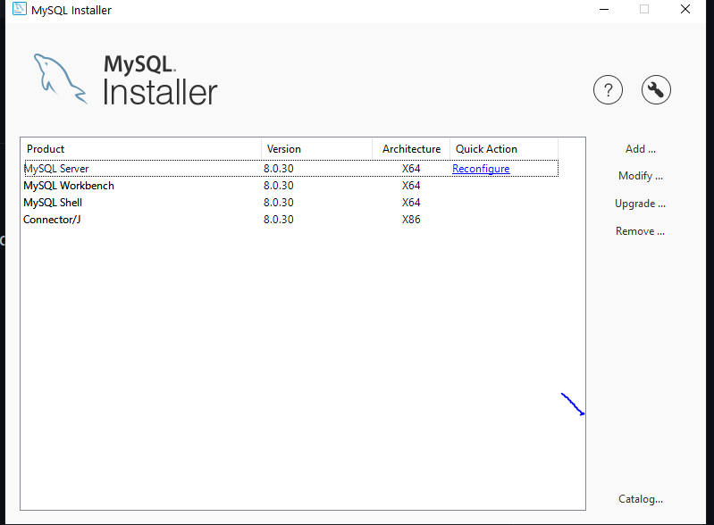
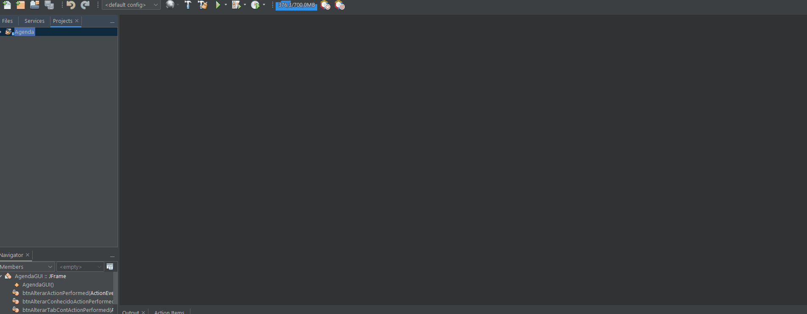
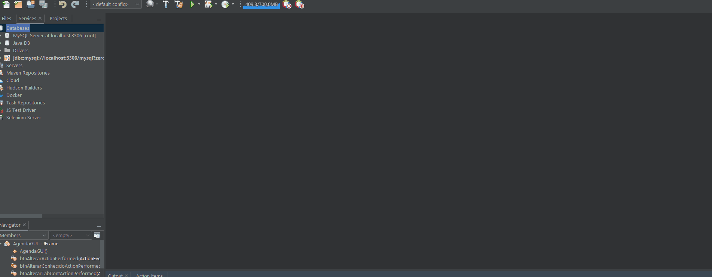
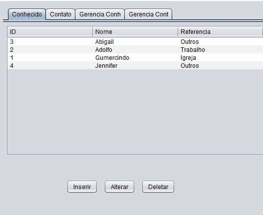
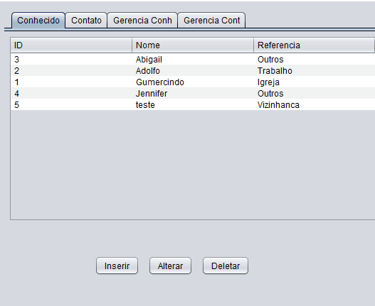
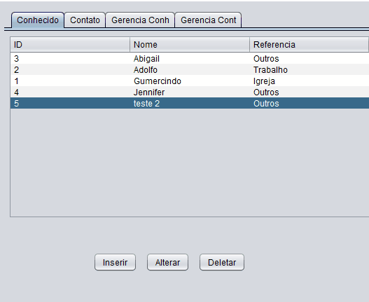
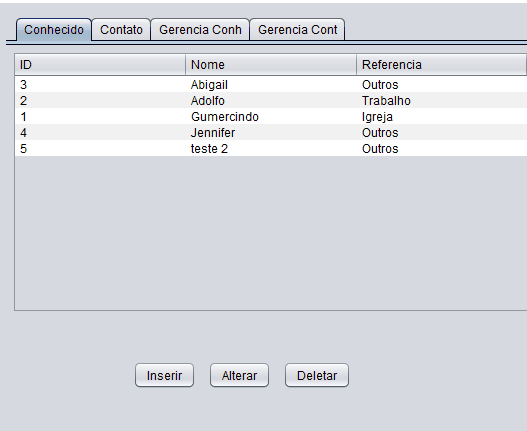
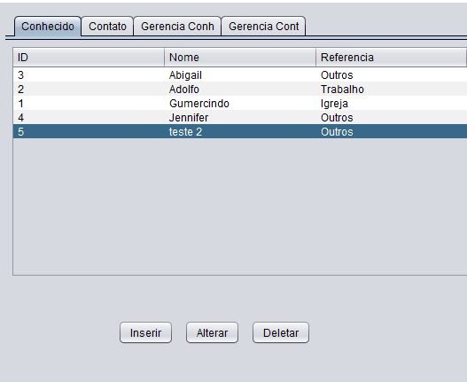

## Exercício do curso entrypoint JAVA da Brq, professor Cid Andrade.
Nesta branch (raphael) está todas as alterações feitas por mim. Já na branch (professor) está o código do professor que recebemos para alterá-lo. 
## <a href="https://drive.google.com/file/d/1S-v5-aNZMSCWquK5FhN2VlZAyzqn0FA3/view)" taget="_blank">link da aula</a>
  <a href="#demoPrograma">Demo</a>

# Descricao do Projeto
O projeto consiste numa agenda de contatos, onde temos uma tabela para os nossos conhecidos e uma tabela onde os contatos destes conhecidos ficam armazenados. E oferece a possibilidade de gerenciar os dados de ambas as tabelas

O programa foi feito em java utilizando sua interface gráfica e conexão ao banco de dados mySql. 
Alguns conceitos utilizados: 
- Vetores multidimensionais ([tutorial loaine groner](https://www.youtube.com/watch?v=P66G0rxdL-k))
- CRUD completo através de classes DAO
- ENUMS
- Alteraçao de foco/visibilidade em elementos da interface gráfica
 

# Instalação
## Primeiro passo: Instalar Java JDK 17
 

## Segundo passo: Instalar mySql
Para utilizar o banco de dados será necessário ter o mysql e o conector java instalado.
Após a instalação, seu instalador do mysql deverá estar assim: 

  

# Configuração

## IDE
Neste projeto utilizei a IDE netbeans, para o programa rodar algumas configurações iniciais são necessárias:

- **Adicionar o conector java do mysql a IDE.** 
Para isto você precisará deste caminho do conector (que foi instaldo junto do mysql) e seguir os passos do gif (no meu caso deu um erro pois já estava adicionado).  
Caminho do conector: C:\Program Files (x86)\MySQL\Connector J 8.0\mysql-connector-java-8.0.30.jar

- **Criar o database utilizado no projeto.** 
Primeiro passo que precisamos para começar o projeto é a criação do banco de dados. 
Para isto, podemos utilizar o workbench do mysql, o prompt de comando ou a própria IDE. Através do comando: 
*Create database agenda;* 
No meu caso fiz através da IDE (novamento o erro se dá já estar criado):

  

  ## Demonstração do Programa
  A seguir alguns gifs com a demonstração do funcionamento pleno do programa para referência.

  ## Tabela Conhecido
  - ### Inserindo Conhecido
  
   

  - ### Alterando Conhecido
  
   

  - ### Removendo Conhecido
  Para remover um conhecido, todos os seus contatos devem ter sido removidos anteriormente, ou seja ele não pode ter nenhum contato salvo ou um erro será apresentado.  
  
    

  ## Tabela Contato
  - ### Inserindo novo contato
  Para inserir um novo contato, primeiro deve-se selecionar o conhecido em que deseja adicionar o contato, na primeira tela, então alterar a tela para contato e então selecionar o botão inserir. O mesmo conceito será utilizado para alteração e remoção.  
  
   

  - ### Alterando novo contato
  
   

  - ### Removendo novo contato
  
 

